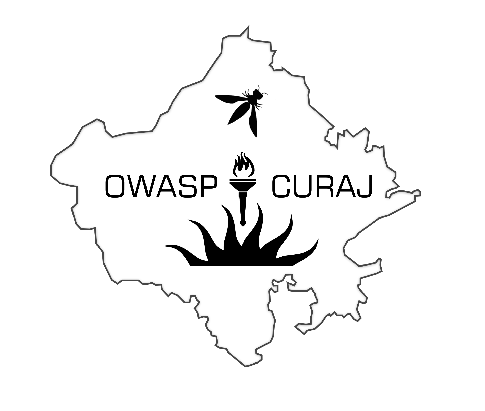

---

layout: col-sidebar
title: OWASP Central University of Rajasthan - Student Chapter
tags: curaj
region: Asia
country: India
meetup-group:

---

# OWASP Central University Of Rajasthan - Student Chapter

Welcome to the OWASP Student Chapter Homepage of Central University of Rajasthan. Ours is a young community of students who strive to develop a culture of cybersecurity and thus nurture the future of it.

---

## About Our University

Established on the 3rd of March 2009, **Central University of Rajasthan** is a Central University under the Central Universities Act of 2009 located on the Jaipur-Ajmer Highway at the edge of the local village of Bandar Sindri.
 
The university consists of over 3000 students as of the year 2022, with a luxurious campus area which is nature-abundant due to its location.

The mission of the university is to become one of India's most dynamic & vibrant universities, providing exceptional educational oppurtunities while building a healthy community of students and is moving towards its goal with a rapid pace.

---
## About Us

We are a community of students in infancy, who aim to build an unprecidented culture & society of Cybersecurity which is on par to the development of our Univeristy, hoping to ignite the same passion in others who can contribute to this field and lead the next leap.

---
